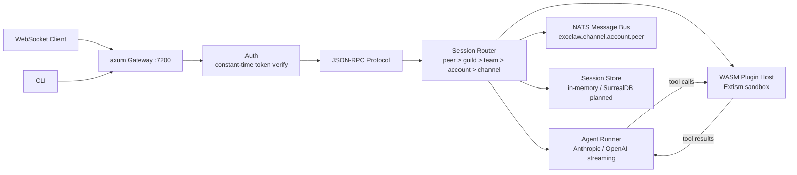

# exoclaw

A secure, WASM-sandboxed AI agent runtime written in Rust.

## What it does

- **Secure agent runtime** -- AI agents run behind a WASM plugin sandbox. Plugins cannot access the host filesystem, network, or memory unless explicitly granted capabilities.
- **Multi-channel messaging gateway** -- WhatsApp, Telegram, Discord, and other messaging channels are loaded as WASM plugins. Adding a channel means shipping a `.wasm` file, not modifying the host binary.
- **Multi-provider LLM support** -- Anthropic, OpenAI, Gemini, and Ollama (planned). Streaming responses with tool-use loops: send messages, get response, execute tool via sandbox, feed result back, repeat.
- **Single binary, runs anywhere** -- One static binary (~15 MB release build with LTO + strip). No interpreters, no node_modules, no container required.

## Why exoclaw?

### vs OpenClaw

OpenClaw is a proven, production-grade agent runtime written in TypeScript. exoclaw takes the same architecture and rebuilds it with different tradeoffs:

| | OpenClaw | exoclaw |
|---|---|---|
| Plugin isolation | Process-level (trust boundary is npm) | WASM sandbox (plugins cannot crash host or touch the filesystem) |
| Concurrency | Single-threaded event loop | Tokio tasks (100K+ concurrent sessions) |
| Codebase | ~50K LOC TypeScript | ~500 LOC Rust (target: ~3K) |
| Distribution | npm install + Node.js 22 | Single static binary |

### vs NanoClaw

NanoClaw is a lightweight macOS-native agent built on Apple Containers. exoclaw targets a different niche:

| | NanoClaw | exoclaw |
|---|---|---|
| Platform | macOS only (Apple Container sandbox) | Cross-platform (Linux, macOS, Windows) |
| Sandbox | Apple Container (macOS-specific) | WASM (portable) |
| Channels | WhatsApp only | Multi-channel via plugins |

### The name

"Exo" as in exoskeleton -- the hard outer shell that protects what's inside. That is what this runtime does for AI agents: provides a rigid, sandboxed boundary between untrusted plugin code and the host system.

## Architecture



**Request flow:**

1. Client connects via WebSocket, authenticates with a token (constant-time comparison).
2. Sends JSON-RPC messages (`chat.send`, `plugin.list`, `status`, `ping`).
3. Session router resolves the target agent using hierarchical binding priority: peer > guild > team > account > channel > default.
4. Agent runner streams the LLM response (SSE). Tool-use results are executed in the WASM sandbox and fed back into the conversation loop.
5. Messages are published to the NATS bus for cross-component routing. If NATS is unavailable, the runtime falls back to local-only in-process routing.

## Quick start

```bash
# Clone and build
git clone https://github.com/exoclaw/exoclaw.git
cd exoclaw
cargo build --release

# Start the gateway (loopback, no auth required)
cargo run -- gateway

# Start on a specific port with auth
cargo run -- gateway --port 8080 --bind 0.0.0.0 --token my-secret

# Check status
cargo run -- status

# Load a WASM plugin
cargo run -- plugin load ./plugins/telegram.wasm
```

The gateway binds to `127.0.0.1:7200` by default. When binding to a non-loopback address, an auth token is required (via `--token` or `EXOCLAW_TOKEN` env var).

## Project status

**Early development. Not production ready.**

### What works

- Gateway server with WebSocket transport and health endpoint
- JSON-RPC protocol with `ping`, `status`, `chat.send`, `plugin.list` methods
- Constant-time token authentication (required for non-loopback binds)
- WASM plugin host -- load, validate, and call plugin functions via Extism
- Hierarchical session router (peer/guild/team/account/channel bindings)
- Agent runner with streaming SSE for Anthropic and OpenAI APIs
- NATS message bus with graceful fallback to local-only mode
- In-memory session store with conversation history
- CLI with `gateway`, `plugin`, and `status` subcommands

### TODO

- [ ] Tool-use loop (agent runner calls tools in WASM sandbox, feeds results back)
- [ ] Gemini and Ollama provider support
- [ ] SurrealDB-backed persistent session store
- [ ] NATS JetStream for message replay and durability
- [ ] Channel plugins (Telegram, Discord, WhatsApp as `.wasm` modules)
- [ ] Plugin capability grants (network, filesystem, env var access)
- [ ] Plugin SDK and guest-side API
- [ ] Configuration file support
- [ ] TLS termination
- [ ] Metrics and observability (OpenTelemetry)
- [ ] Multi-agent orchestration
- [ ] Tests

## Stack

| Component | Crate | Role |
|---|---|---|
| Async runtime | `tokio` | Task scheduling, I/O, timers |
| HTTP / WebSocket | `axum` | Gateway server, WebSocket upgrade |
| WASM plugins | `extism` | Sandboxed plugin host (Wazero-based) |
| Message bus | `async-nats` | Inter-component routing, pub/sub |
| Storage | `surrealdb` (planned) | Session persistence, agent config |
| Wire format | `rmp-serde` | MessagePack serialization |
| HTTP client | `reqwest` | LLM API calls (streaming SSE) |
| CLI | `clap` | Command parsing, subcommands |
| Logging | `tracing` | Structured, filterable logging |

## License

MIT OR Apache-2.0
